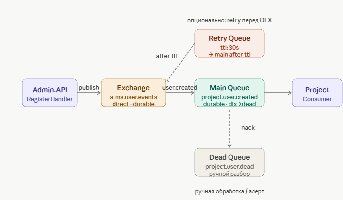

# ATMS.Messaging
###### Shared infrastructure library for RabbitMQ messaging across ATMS microservices.

---

## Table of Contents
* What is a message queue
* What is RabbitMQ, key concepts
* Exchange types
* Reliability patterns
* Library structure
* Add new event

---


## What is a message queue
Think of a post office. A sender drops a letter in a box and forgets about it. The receiver opens the box when ready and picks up the letter. They never talk directly and don't need to be online at the same time.

A message queue works the same way. One service (Producer) sends an event to the queue. Another service (Consumer) reads it when ready. They are independent — if the Consumer crashes, messages accumulate in the queue and will be delivered when it comes back up.

This is not a socket.A socket is a direct real-time connection (like a phone call). A queue is a middleman (like a post office). Under the hood RabbitMQ.Client does use a TCP socket for transport, but a Consumer is logic built on top of it: a subscription to a queue through a persistent open channel.

---


## What is RabbitMQ, key concepts
RabbitMQ is a message broker. It accepts messages from Producers, stores them in queues, and delivers them to Consumers.

- Connection — one TCP connection to the broker. Expensive to create, should be one per application.
- Channel — a lightweight virtual channel inside a Connection. Created and closed frequently.
- Exchange — the entry point. A Producer sends a message to an Exchange, not directly to a queue.
- Queue — message storage. A Consumer reads from a queue.
- Binding — a rule: "messages from Exchange X with routing key Y go to Queue Z".
- Routing Key — a label on a message. The Exchange uses it to decide which queue to send to.

---


## Exchange types:
* Direct — Message goes to the queue whose routing key matches exactly.
* Fanout — Broadcasts to all bound queues, ignoring routing keys.
* Topic — Routes by patterns (e.g., user.#, *.created).
* Headers — Routes based on headers; rarely used.

--- 


## Reliability patterns
* Durable queue + Persistent message — queues and messages survive broker restarts. Mandatory in production.

* Acknowledgement (ack/nack) — the consumer explicitly says “processed” or “failed.” Without this, if the service crashes, the message can be lost.

* Dead Letter Exchange (DLX) — if a message fails N times, it’s routed to a dead-letter queue for manual inspection. Mandatory in production.

* Retry with TTL — before going to DLX, the message is sent to a retry queue with a delay (via TTL + DLX pattern), then returned to the main queue.



---

### 1. Durable Queue + Persistent Message
- Durable: true on a queue — the queue is saved to disk and survives a broker restart.
- Persistent: true on a message — the message itself is written to disk, not just kept in RAM.

Both are needed together. Without durable the queue disappears. Without Persistent — the queue comes back empty.


### 2. Acknowledgement (ack / nack)

By default RabbitMQ considers a message delivered as soon as it hands it to the Consumer. Even if the Consumer crashes mid-processing.
- autoAck: false means: don't delete the message until the Consumer explicitly says so.

- BasicAck — "processed successfully, delete the message"
- BasicNack — "failed to process, decide what to do"

Without this: Consumer crashes — message is lost forever.
With this: Consumer crashes — message goes back to the queue.


### 3. Dead Letter Exchange (DLX)
When a Consumer does BasicNack with requeue: false — where does the message go?
Without DLX: deleted forever.
With DLX: sent to a special "dead" queue. You can investigate what went wrong, fix the bug, and re-send.
Scenario: 100 events came in, there was a bug, all 100 landed in DLX. Fixed the bug — took all 100 and re-sent them. Without DLX those 100 events would have been lost forever.


### 4. Retry Queue с TTL

Sometimes the error is temporary — the database was unavailable for 5 seconds. There's no point throwing it into DLX immediately. Better to wait and retry.
Retry Queue — a queue with no Consumer. A message lives there for N seconds (TTL), then RabbitMQ automatically moves it back to the main queue. Consumer tries again.
After several attempts — it goes to DLX so it doesn't loop forever.

----


## Library structure
```
    ATMS.Messaging
    ├── Configuration/
    │   └── MessagingConstants.cs            ← All names of exchanges, queues, routing keys
    ├── Infrastructure/
    │   ├── RabbitMqConnectionFactory.cs     ← One connection on whole app
    │   ├── RabbitMqPublisher.cs             ← Sending messages
    │   ├── RabbitMqConsumerBase.cs          ← Base class for all Consumers
    │   ├── MessagingConstantsInitializer.cs ← Creates all exchanges, queues into RabbitMQ app
    │   └── ConsumerHostedService.cs         ← Bridge between Consumer and IHostedService
    ├── Interfaces/
    │   ├── IMessagePublisher.cs
    │   └── IMessageConsumer.cs
    ├── Models/
    │   └── MessageEnvelope.cs               ← Model for more info
    └── Modules/
    └── MessagingModule.cs                   ← Register DI
```

---


## Add new event
- In ATMS.Contracts/Events create a new record.
- In MessagingConstants add queue and routing key constants.
- In MessagingConstantsInitializer add an initialization block following the same pattern as UserCreated.
- In the Handler call messagePublisher.PublishAsync(...) with the new routing key.
- In the target microservice create a new Consumer inheriting from RabbitMqConsumerBase<T>.
- Register in the Module.